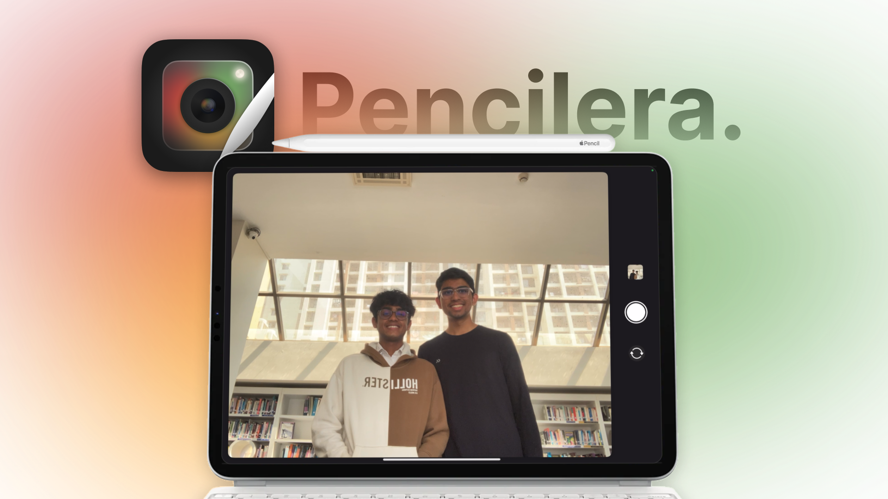

# Pencilera


<a href=https://apps.apple.com/app/pencilera/id6550425272 target="_blank">
  
</a>

**Pencilera** is an innovative iPad app that turns your Apple Pencil into a camera remote. Whether you're taking a group photo or just want to capture the perfect shot from a distance, Pencilera provides a simple yet powerful solution by utilizing the gestures supported by Apple Pencil.


## Features

- **Camera Remote:** Use your Apple Pencil to control the camera on your iPad. Double-tap gestures on Apple Pencil 2 and squeeze gestures on Apple Pencil Pro can be used to capture photos.
- **Easy Setup:** Simply install the app, and you're ready to start using your Apple Pencil as a camera remote.
- **Privacy Focused:** Pencilera does not collect any personal data, ensuring that your privacy is maintained at all times.
- **Free and Open Source:** Pencilera is completely free to use, with optional tips to support development. The app is open source, allowing developers to contribute and learn from the project.


## Installation

To build the project locally:

1. **Clone the repository:**
    ```bash
    git clone https://github.com/OmChachad/Pencilera.git
    ```
2. **Navigate to the project directory:**
    ```bash
    cd pencilera
    ```
3. **Open the project in Swift Playgrounds on iPad or Mac:**
    ```bash
    open Pencilera.swiftpm
    ```
4. **Resolve dependencies:**
    Pencilera uses several Swift packages that need to be resolved before using.

5. **Build and run the project:**
    - If you're using it via Xcode on Mac
        - Select the Pencilera target.
        - Choose your preferred connected iPad.
        - Click the Run button or press `Cmd + R`.
    - If you're using Swift Playgrounds on iPad
	      - Click the Play Button to Run

Download Pencilera from the [App Store](https://apps.apple.com/app/pencilera/id6550425272).

## Usage

1. **Double Tap:**
    - If you have an Apple Pencil 2nd Generation, double tap its stem to instantly capture a photo.

2. **Squeeze:**
    - If you have an Apple Pencil Pro, squeeze its stem to capture a photo.


## Contributing

We welcome contributions from the community! To contribute:

1. Fork the repository.
2. Create a new branch for your feature or bug fix:
    ```bash
    git checkout -b feature-name
    ```
3. Make your changes and commit them:
    ```bash
    git commit -m "Description of your feature or fix"
    ```
4. Push to your branch:
    ```bash
    git push origin feature-name
    ```
5. Create a Pull Request on GitHub.

## Open Source Packages Used

Pencilera leverages several open-source packages to enhance its functionality:

- **[VariableBlurView](https://github.com/aheze/VariableBlurView)**: A Swift-based package that provides a customizable blur effect. It’s a one-file, App Store upload-safe version of Janum Trivedi's variable blur effect, obfuscated to bypass Apple’s private API restrictions while remaining functional. | Used during onboarding

- **[FluidGradient](https://github.com/Cindori/FluidGradient)**: A Swift package designed to create animated fluid gradients for modern UI designs. It provides an easy-to-use interface for generating smooth, colorful gradients with motion effects. | Used during onboarding to provide the background


## Acknowledgments

Pencilera is developed and maintained by [Starlight Apps LLP](https://starlightapps.org).


## Contact

For any inquiries or feedback, please open an issue on GitHub or contact us at contact@starlightapps.org.

## License

This project is licensed under the Creative Commons Zero v1.0 Universal License - see the [LICENSE](LICENSE) file for details.

---
